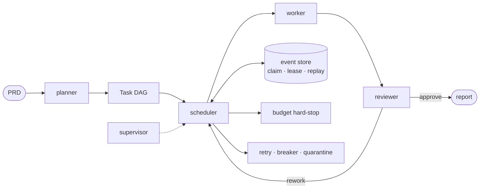

<div align="center">

**AI Agent & LLM Infra Engineer** — I debug agents where abstractions leak.

<p>
  <a href="https://github.com/NVIDIA/NeMo-Agent-Toolkit/pulls?q=is%3Apr+author%3ACodeAlex52"></a>
  <a href="https://github.com/google/adk-js/pull/922"></a>
  <a href="https://github.com/strands-agents/harness-sdk/pull/4263"></a>
  <a href="https://github.com/BerriAI/litellm/pull/40581"></a>
</p>

`Python` · `TypeScript` · `Go` ｜ `Agent Runtime` · `Tool Calling` · `Streaming` · `Guardrails` · `Observability`

</div>

---

## 🏆 Merged in production AI stacks

| Contribution | Status |
| --- | --- |
| **NVIDIA · NeMo Agent Toolkit** — the ReAct parser silently accepted JSON-formatted actions as *final answers*, so the tool the model asked for was never called. Quoted keys plus `action_input`/`input` variants now parse explicitly, and a JSON action missing its input raises instead of being swallowed. — [#2275](https://github.com/NVIDIA/NeMo-Agent-Toolkit/pull/2275) | ✅ **Merged** |
| **NVIDIA · NeMo Agent Toolkit** — Agent Security guardrails analyzed typed streaming chunks as Python reprs, corrupting PII detection, content safety and output verification. Shared typed stream→text conversion path + regression coverage across all three middlewares. — [#2236](https://github.com/NVIDIA/NeMo-Agent-Toolkit/pull/2236) | ✅ **Merged** |
| **Google · ADK-JS** — Gemini 3.5 Live Translate was routed through the Gemini 3.x Live path; now excluded so live translation resolves through the supported model, matching `adk-python`. — [#922](https://github.com/google/adk-js/pull/922) | ✅ **Merged** |
| **AWS · Strands Agents** — forced structured-output retries could be preempted by provider-native tools through a generic `tool_choice`; fixed with multi-cycle retry regression tests. — [#4263](https://github.com/strands-agents/harness-sdk/pull/4263) | ✅ **Merged** |
| **LiteLLM** — diagnosed wrong model-capability metadata forwarding unsupported `reasoning_effort=minimal`; the fix landed on `main` through the upstream registry batch PR. — [#40547](https://github.com/BerriAI/litellm/pull/40547) → [#40581](https://github.com/BerriAI/litellm/pull/40581) | 🚢 **Fix shipped upstream** |

---

## 🚀 Featured work

### [AgentCorp](https://github.com/CodeAlex52/AgentCorp) — crash-recoverable multi-agent delivery orchestrator

`(git repo, PRD) → reviewed delivery + auditable event ledger` — local-first and **offline-verifiable**: 310 deterministic tests that need no network and no API keys.



**Failure-path first — each claim has a runnable test:**

| Claim | Evidence |
| --- | --- |
| exactly-once dispatch | 64 threads race one task; exactly one claim wins (`tests/test_store.py`) |
| crash recovery | real `SIGKILL` mid-run → `resume`; DONE tasks never re-run (`tests/test_recovery_subprocess.py`) |
| concurrent resume guard | per-run OS lock: a second resumer fails fast instead of double-running (`tests/test_resume_guard.py`) |
| budget hard-stop | four-dimensional check-before-dispatch with admission reservations |
| replayability | `verify_replay()` reproduces the projection byte-for-byte after rework and crashes |
| real-provider smoke | opt-in `-m smoke` runs the same Engine path against a live provider and prints run metrics (`tests/test_smoke_provider.py`) |

```bash
uv run pytest -q                        # 310 deterministic tests, ~5s
uv run python examples/end_to_end.py    # byte-reproducible benchmark run
```

---

### [agent-loop-trace](https://github.com/CodeAlex52/agent-loop-trace) — turn agent loop bugs into a shareable timeline

`event log → JSON IR → 5 validations → single-file HTML` · node ≥ 18, zero dependencies.

This is how I explain my own merged fixes — Strands #4263 forced-retry preemption, DSPy #10363 reward path — as a verifiable sequence diagram:

<a href="https://github.com/CodeAlex52/agent-loop-trace"></a>

---

<details>
<summary><b>🔬 In review — 21 PRs across NVIDIA · Cloudflare · Meta · Kubernetes · Sentry · Vercel · Stanford · Anthropic · …</b></summary>

<br/>

| Project | PR | What |
| --- | --- | --- |
| NVIDIA · k8s-device-plugin | [#2067](https://github.com/NVIDIA/k8s-device-plugin/pull/2067) | wait for the node label before the first config sync |
| Cloudflare · Pingora | [#1021](https://github.com/cloudflare/pingora/pull/1021) | finish the brotli stream before returning its output |
| Meta · RocksDB | [#15275](https://github.com/facebook/rocksdb/pull/15275) | restore `value_size_soft_limit` progress guarantee for blob reads in MultiGet |
| Kubernetes · Cluster API | [#14301](https://github.com/kubernetes-sigs/cluster-api/pull/14301) | KCP: propagate `DNS.imageRepository` when updating the kubeadm config map |
| Sentry | [#126044](https://github.com/getsentry/sentry/pull/126044) | keep fix-keyword ID lists on a single line |
| Vercel · AI SDK | [#21214](https://github.com/vercel/ai/pull/21214) | skip `onInputAvailable` for invalid streamed tool inputs |
| Vercel · AI SDK | [#21352](https://github.com/vercel/ai/pull/21352) | await `onFinish` in `useObject` so rejected async callbacks surface via `onError` |
| Stanford · DSPy | [#10487](https://github.com/stanfordnlp/dspy/pull/10487) | trust `Prediction(score=...)` when accepting bootstrapped traces |
| Stanford · DSPy | [#10363](https://github.com/stanfordnlp/dspy/pull/10363) | partial-credit fraction and zero `format_reward` handling |
| Anthropic · sandbox-runtime | [#558](https://github.com/anthropics/sandbox-runtime/pull/558) | drain a denied upload before tearing the socket down |
| Prometheus · procfs | [#876](https://github.com/prometheus/procfs/pull/876) | parse arm64 CPU identity fields (implementer / variant / part / revision) |
| CrewAI | [#7620](https://github.com/crewAIInc/crewAI/pull/7620) | strip single quotes when matching coworker roles |
| Helicone | [#5817](https://github.com/Helicone/helicone/pull/5817) | stop double counting accepted prediction tokens in usage processors |
| AWS Strands · Harness SDK | [#4655](https://github.com/strands-agents/harness-sdk/pull/4655) | report malformed tool input JSON to the model as an error tool result |
| Traceloop · OpenLLMetry | [#4507](https://github.com/traceloop/openllmetry/pull/4507) | record Bedrock operation duration per call instead of client age |
| Agent Router · Envoy AI Gateway | [#2730](https://github.com/theagentrouter/agent-router/pull/2730) | redact error response bodies per OpenInference `TraceConfig` |
| TencentCloud · Octop | [#703](https://github.com/TencentCloud/Octop/pull/703) | align dashboard Ollama-local detection with backend |
| TencentCloud · TencentDB Agent Memory | [#1378](https://github.com/TencentCloud/TencentDB-Agent-Memory/pull/1378) | skip DSH permission notice in fresh-session detection |
| Prefect · Marvin | [#1393](https://github.com/PrefectHQ/marvin/pull/1393) | handle bare `List` in `is_classifier` / `as_classifier` |
| Milvus · pymilvus | [#3792](https://github.com/milvus-io/pymilvus/pull/3792) | align membership filter expressions with `membership_match` |
| Desktop Commander MCP | [#726](https://github.com/wonderwhy-er/DesktopCommanderMCP/pull/726) | accept `limit` as an alias for `length` in `read_file` |

</details>

<p align="right"><a href="https://github.com/search?q=is%3Apr+author%3ACodeAlex52&type=pullrequests">All pull requests →</a></p>

---

## 🔁 How I work

```text
Reproduce → Trace → Root Cause → Fix → Regression Test → Review → Upstream
```

Every claim on this page links to a PR diff or a test you can run; merged and open are labelled per item. I optimize for a complete evidence chain from failure to verified fix — not patch size.
